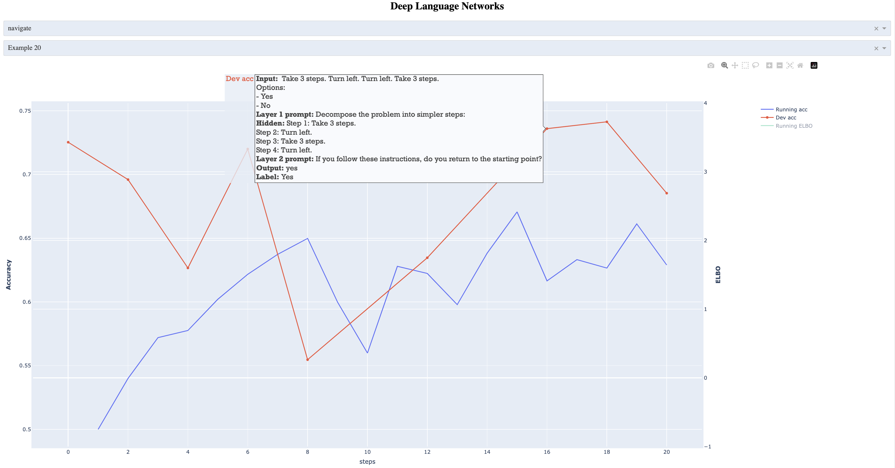

# Deep Language Networks Demo



## Install dependencies
    pip install -r requirements.txt

## Generate plot for the given results json file
    python demo.py result_data.json

## Visualizing your results
1. Please see the [Variational Inference README](projects/vi_dln/README.md) for information on how to run experiments. e.g.,  
```
python scripts/one_layer/one_layer.py --dataset subj
bash scripts/two_layers_e2e/data_understanding.sh
```
2. This will update the result_data.json file with your results.
3. Run the demo.py file to generate the plot for your results.
```
python demo.py result_data.json
```
